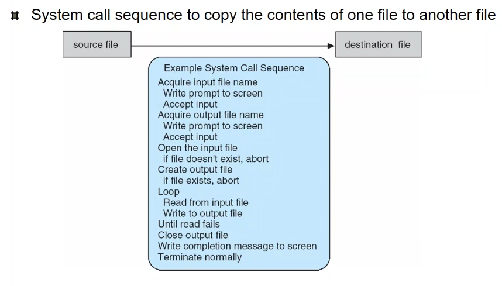
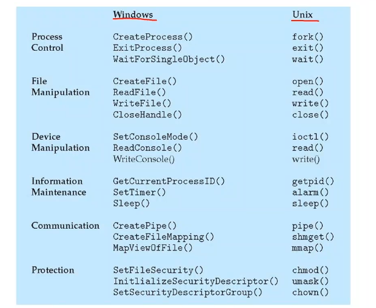

# Week3 os overview

## structure

Multiprogramming

When IO is working just do another job via job scheduling

Time-sharing

When the Response time is small enough switch jobs frequently. Do swapping when the Process don't fit. Use virtual memory to scale down the program

Interrupt driven by hardware

Error also for exception and trap

Dual mode

User mode and Kernel mode

Kernel mode to do actions that affects reg or such

User mode cannot do that only via system call

Trap으로 모드를 변경함

## Process Management

Process 는 뭔가? 프로세스는 실행중인 프로그램이다.

실행중인 프로그램의 실체를os가 프로세스로 만들어준다.

CPU가 필요하고 memory, IO, files, Init data 가 필요하다. 이것을 묶어서 관리하기 위해서 쓰이는 자료구조가 process이다. 여기 코드도 있고 우선순위, 메모리 어딘지 IO를 뭘 쓰는지 등이 있다. 이 자료구조가 메모리에 올라가서 작동한다. 끝나면 자료구조를 삭제함.

프로그램 카운터가 single thread의 경우 하나만 있으면. 여러 프로그램을 thread하는 경우 여러개가 필요함.

OS가 하는일 총정리

1. process 를 만들고 없애기
2. suspend, resume ctrl+z 같은거
3. 싱크로를 해주는 것
4. 서로 데이터 주고 받게 하는것
5. 데드락 핸들링

### 메모리 관리

- 모든 데이터는 메모리에 올라감
- 어디에 뭐가 있는지 알아야함 메모리 매니지를 해줌
- Layout을 관리함 어느 프로세스가 어디 있는지
- 작동중
  - 누가 어느 작업을 어떻게 쓰고 있는지
  - 어느 작업을 내리고 올리고 할지 (swapping)
  - 메모리 동적 할당(malloc)

### 스토리지 관리

- 매우 복잡한 hard disk 관리를 app에게 사용 가능하게 해줌. abstraction을 통해 오로지 파일이라고 말하면 저장은 os가 해줌, 어디 저장되는진 신경 안써도 됨.
- 파일 유지보수, 저장, 삭제 등, 데이터 바꾸기, 다른곳에 저장하기 등

### MASS-storage management

- 하드 다스크 안에 비어있는 공간, 어느 파일이 어디에 있는지 등
- IO를 빨리 처리하기 위해 순서를 바꾸면서 빠르게 실행함

A라는 데이터를 저장하는 과정

디스크에서 -> 메모리로 올라가고 -> 캐시로 올라가고 -> 레지스터로 올라감

1번 프로그램이 a에 접근하고 2번 프로그램이 또 a에 접근하는 경우 이 a는 항상 최신이여야 함.

코어가 하나일때는 문제 없음 그러나 여러개일 경우 코어당 캐시가 있음으로 업데이트가 안됨 값을 가지고 있을수 있음. 고려 되어야 함

### I/O subsystem

종류가 너무 많음 맏길수 없음. OS가 지원해 줘야함. 데이터 저장용 블락인지 아니면 입력장치인지만 말해라 정도로 해줘야 함.

IO의 느림을 해결하는 buffering, caching , spooling등을 진행함

spooling은 데이터를 직접 보내는게 아니라 중간에 넣었다가 여기서 다시 보내줌 프린트도 이거 씀ㄴ

### protection security

공격에 대한 방어

당위성이 없는 권한이 없는 접근을 금지함.

ID를 만들어서 파일을 저장, 프로세스가 관할함.

사용자가 접근하는 것에 대해 프로세스가 사용자의 권한을 계승 받아서 작업함. ID가 가진 권한을 그대로 가지게 됨.

OS가 만든 영역에 사용자가 쓸수 없음. print의 경우 잠시 권한을 주고 spool에 접근시켜 줌.

### Service

다양한 일들을 함. 프로세스를 대체 누가 만드는가?

프로세스를 만드는 서비스를 OS가 제공함. Fork 라는 시스템 콜이 실행되면 하나의 새로운 프로세스를 생성해줌. 이런 서비스를 제공하는 것을 사용하는 것이 System Call을 호출하는 것이다.

- User interface
- program exec
- file
- i/o
- communication
- error
- 자원 할당
- 어떤 사용자가 얼마나 자원 쓰는지
- 프로텍션 등

### System Call

Service를 사용하기 위한 인터페이스

Write라는 시스템을 호출할려면 매우 단순하지만 쓰기는 귀찮음. 그래서 printf를 씀. 이 안에는 시스템 콜이 여러번 호출됨. API라고 부른다.

System call은 매 os마다 다름. 그래서 os마다 다른 프로그래밍을 해야함. 그런데 printf를 사용하면 굳이 안해도 알아서 해줌. 하나의 API로 해결할수 있게 됨.

| example

cp 를 사용할때 발생하는 일들

각 시스템콜 마다 번호가 있음. 이 번호로 메모리에 있는 콜에 접근함. 메모리에 시스템 콜의 주소가 되어있어 프로그램 카운터가 그곳으로 넘어가서 실행함.

| 두가지 사용하는 방법

직접 호출

- Open을 하면 kernel모드로 가서 사용하고 돌아옴

라이브러리 사용

- 라이브러리 안에 있는 코드를 수행 그 안에서 write()를 사용

### Types of system call

시스템 콜이 서로 다른걸 볼수 있다

### virtual machine

왜 필요한가? 직접 테스트 해볼려고. + 하나하나 해보기 위해서

Java 가 다이나믹한 환경을 해결하기 위해 java virtual machine을 사용해서 하나로 해결할수 있음. 어느 기계에서도 작동함.
