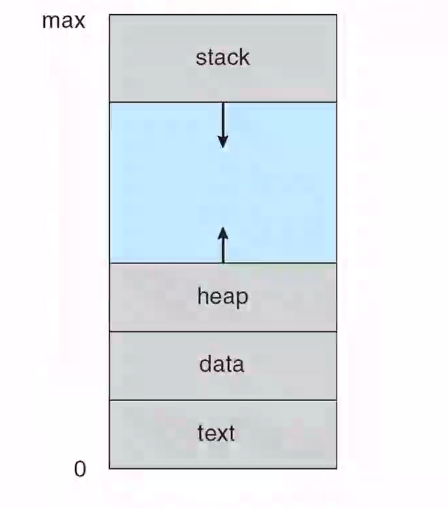
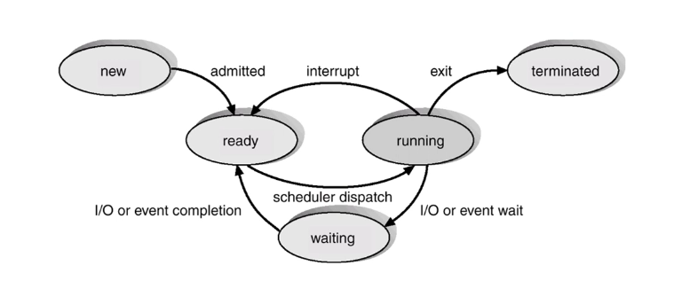
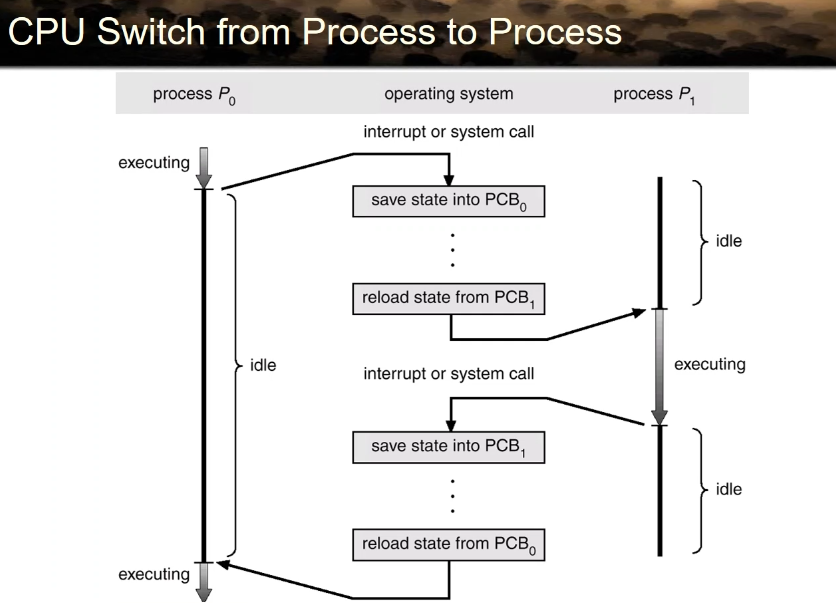
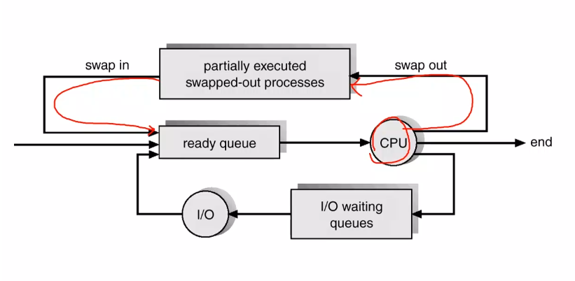
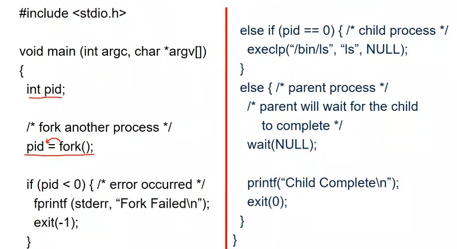
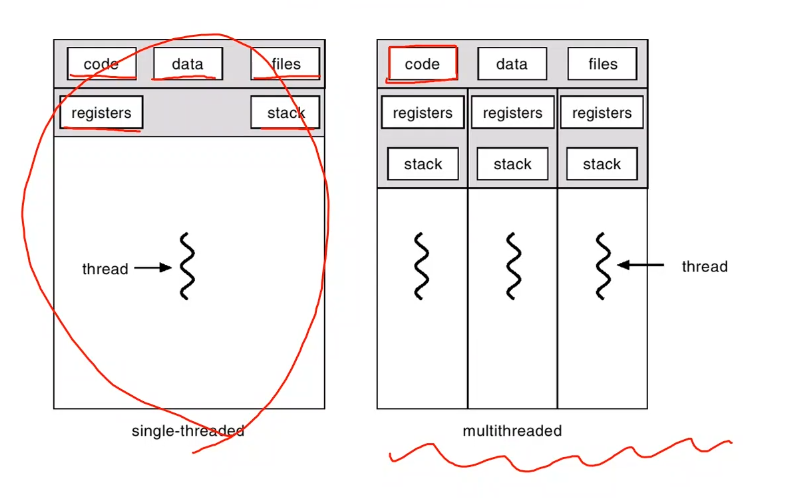

# process and thread

## process concept

- 프로세스
  실행중인 프로그램.
  순서적으로 실행됨

- 뭐가 있냐

텍스트섹션- 코드

- 리턴 어드레스나 이런걸

스택 - 패러메터 등 돌아가는 곳, 로컬 변수 등 스택으로 팝으로 어디로 돌아가는지 알수 있음
데이터 - static, global
heap - malloc용
program counter와 register

연속된 주소공간에 로지컬하게 0번지부터 시작됨.

텍스트(코드), 스태틱 변수, 전역변수는 고정된 크기를 가짐.

힙과 스택은 동적으로 변함. 주소공간의 크기가 논리공간임으로 max가 무척 큼 거의 안만남. 이걸 주소공간이라 부름

프로세스 5가지 상태

- New
  - 새로 만들어지고 cpu에 할당은 안됨. 실시간 시스템에서 deadline을 충족시키기 위해 필요하다. 이제 할당시 기존 프로세스가 데드라인 못 맞추면 안함
- Run 실행중
  - 현재 cpu잡고 실행중 항상 하나
- waiting
  - IO가 끝나길 기다리는 상태 이벤트를 기다림. Interrupt가 끝났다고 알려줌
- Ready
  - 언제든지 cpu 할당 가능.
- Terminated
  - 다 끝나고 없애 버리기 전

admitted가 되면 ready로 가고 scheduler가 dispatch하면 running에서 진도를 나감.

다 하면 exit() interrupt가 발생 즉 실행 시간 이 끝난 경우 ready. 할당된 시간이 다 끝났다는 걸 timer가 알려준다. timer interrupt

IO가 발생 시키면 waiting으로 빠짐. CPU를 놯버림 다 끝나면 ready 로 넘어감.

### Process control Block

일반적으로 프로세스를 만드는 자료구조

- Process state
- Program Counter
- CPU registers
- CPU scheduling info (priority)
- Memory-manage(heap 위치 등등)
- Accounting(얼마나 사용했는지 cpu)
- IO status info(뭘 사용했는지 등등)

Switching

시스템 콜이 호출 되는 경우 스테이트를 pcb에 저장. 이제 저장 했으니, 다른 시스템 콜을 불러와서 실행하고 다시 pcb에서 읽어와서 진행

Job queue

- 모든 프로세스를 모은곳

Ready queue

- cpu를 기다리는 프로세스들이 모이는 큐

Device queue

- 어느 디바이스를 기다리른 queue

계속 이 queue사이를 이동함

CPU를 누구에게 줄지 결정해야함.

Long-term: 누구를 new에서 ready에 올릴지 결정. 새로 생성된 프로세스중 선택함으로 빈번하지 않음. (degree of multiprogramming - 지금 이 큐에 있는 모든 프로세스의 수)

short-term: ready에서 run 누구를 cpu로 올릴지 계속 실행됨

Medium-term: 메모리가 꽉 찼을시 사용하는 스케줄러

대상이 되는 프로세는 일시 중지 시킨 process. (suspend)

프로세스는 두가지

- IO bound process: IO가 많이 발생하여 cpu사용을 많이 안함
- CPU bound process: 계산을 많이 해야함

### Context switch

다른 프로세스로 가면 context가 바뀜. 현재의 상태가 어디로 저장해야 하고 새로운 걸 cpu에 올려야 함. 멀티프로그래밍을 위해 감내 해야 하는 overhead.

자주 일어 남으로 overhead를 짧게 해야함. 문맥 교환 뿐만아니라, cache overhead.

캐시에는 현재 진행 중인것만 있음. 새로운게 들어오면 다 바뀌어야 함. 캐시 미스가 계속 일어남으로 memory 접근을 해야 만 함.

### Process Create

만들어라고 하는 주체는 누구인가? 또 하나의 프로세스.

새로 부팅시 단군할아버지가 만들어지고 터미널 같은게 쉘 만들고 그 위에 사람이 만든거 실행됨. 트리 형태로 쭉 내려감.

Pid로 구분하게 됨

부모와 자식은 어떤 관계가 있을것인가? 아무런 관계가 없고 그냥 만들고 만든 관계이다. context에서 의미가 없지만, 리턴값을 받아줄 parent가 필요함.

웹서버는 부모와 자식 다 비슷함. 같은 코드 다른 곳을 수행함. 이런 경우 자원을 공유 가능.

동시에 도는 경우가 일반. 그러나 어떤 경우 기다리고 리턴하면 다시 도는 경우도 존재함.

Address space에는 뭐가 들어가는가? 자식은 부모의 space를 그대로 가져감. child에서 다시 정해줌

두 놈이 구분하는 법은 fork되는 시점을 정확히 알아야 한다. 정확히 똑같은 위치로 가는가? fork system call은 부모에겐 pid 자식에겐 0을 줌.

두 프로세스는 똑같은 코드 임으로 fork()가 실행되자 마자의 프로세스가 생김. 이때 fork의 반환 값으로 컨트롤 함. 여기서 완전히 달라짐.

### single thread and multithreaded

- 프로세스와 쓰레드의 주요 차이점은 다음과 같습니다:

독립성: 프로세스는 독립적인 실행 단위로, 각 프로세스는 별도의 메모리 공간을 가집니다. 반면에 쓰레드는 같은 프로세스 내에서 실행되며, 프로세스의 메모리 공간을 공유합니다.

통신 방법: 프로세스 간 통신은 복잡하며 시스템 자원을 많이 소모합니다. 반면에 쓰레드 간 통신은 같은 메모리 공간을 공유하기 때문에 상대적으로 간단하고 빠릅니다.

생성 및 종료 비용: 프로세스의 생성 및 종료 비용은 쓰레드에 비해 높습니다. 쓰레드는 같은 프로세스 내에서 생성되므로 비용이 적게 듭니다.

문맥 교환 비용: 프로세스 문맥 교환이 쓰레드 문맥 교환보다 비용이 더 많이 듭니다. 쓰레드는 같은 메모리 공간을 공유하므로 문맥 교환이 더 빠르고 효율적입니다.

코드는 동일함. 데이터나 파일을 같음. 그러나 stack과 상태 정보인 register는 달라야 한다.

하나의 프로세스안에 존재하는 동적인 개념이다.

light-weight process라고 부르기도 한다.

운영체제의 자원을 공유한다.

좋은 점.

- 프로세스가 하나만 있고 IO를 사용한다면 계속 멈출수 있지만. 이건 다른거 가능
- 똑같은 내용을 여러번 올릴 필요 없이 자원 공유 할수 있어 효율적이다.
- overhead가 작다. 메모리를 따로 공유함으로 thread를 만들고 없애는 overhead가 매우 작다.
- 하나의 프로세스를 여러개의 core에서 실행 가능하다.

Thread

- Kernel thread
  유저가 만든것이 아닌 커널이 만들었다. 고로 관리가 가능하다.
- User thread
  유저가 만드것은 프로세스와 같다. kernel의 도움이 없음으로 만들기와 지우기가 편하다.
