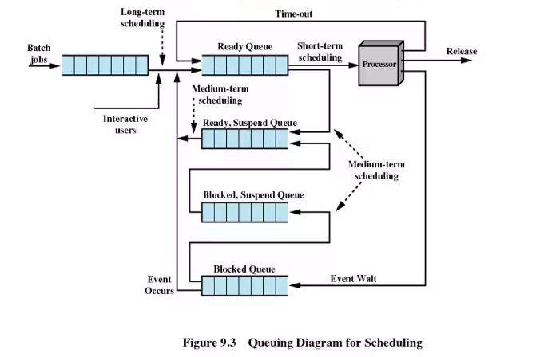
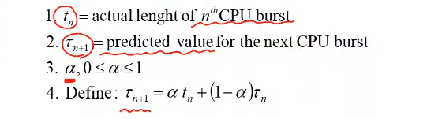
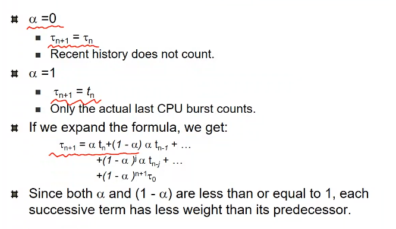

# CPU scheduling

Process scheduling은 프로세스의 상태를 변화 시키는 것

그중 cpu scheduler (short term scheduler) 현재의 cpu를 누구에게 줄지를 정하는 것. Job을 running으로 만드는 것.

## CPU, IO burst

프로세스는 계속 반복적으로 cpu, io를 왔다갔다 함. alternative 라고 함

한번 잡으면 오래 하는 녀석들 - cpu bound job
잠시 썼다가 다시 Io하는 애들 - IO bound job

CPU에게 IO bound인가 cpu bound인가 할때 IO bound가 맞다. 왜냐 면 cpu는 오래 걸림으로 별 차이 않난다.

사용자의 interaction이 바로 만들어줘야 좋다.

Blocked_suspend queue 기다리는 중에 suspend하면 유저가 ready_suspend로 감. ready중에 suspend하면 바로 저기로 옴김. 미디엄텀스케줄러가 일을함. swapping시 얘가 하니까 이것도 함.

### CPU Scheduler

4가지 경우로 발생함

- Waiting으로 돌아감 io request해서
- 시간 지나서 ready로 돌아감
- 다른 작업의 io interrupt가 일어나서 ready로 감
- 끝남

1번과 4번은 nonpreemptive 강제가 아닌 자의적으로 된것

### Dispatcher

선택된 process에게 cpu를 넘겨줌

- Context switching <- overhead이다
- Kernel 모드에서 다시 user mode
- 프로그램을 다시 적절한 위치에서 시작함.

### 성능 지표

1. \*CPU util - cpu가 얼마나 많이 쓰는가?
2. Throughput - 단위 시간당 process의 수
3. Turn around time - 시작한 뒤에 끝나는 시간
4. \*Waiting time - ready queue에서의 기다리는 시간
5. Response time - 사용자가 시작하고 첫 응답까지의 시간. 상호 작용성을 느끼게 함. 새로운 작업이 주어졌을때 첫 반응 시간.

### algorithms

#### FCFS

first come first serve

FCFS는 들어온 순서대로 진행함으로 preemtion이 일어나지 않는다. 큰 작업이 먼저 오면 작은 작업이 오래 기다려야 한다. 순서에 따라 waiting time에 매우 나쁜 영향을 줄수 있음. (convoy effect)

#### SJF

Shortest job first 얼마나 사용할지 예측하여 먼저 하겠다.

Nonpreemtive or preemtive: 제일 짧은애에 줬는데 더 짧은것이 들어왔을때 줄지 말지

#### SRTF

뺐는 것을 SRTF로 부른다. Average Waiting time은 optimal하다 최고다.

이 알고리즘들을 알기 위해선 CPU를 얼마 사용할지는 모르는 것이다.

과거에 얼마나 사용했는지에 대해 측정하여 사용. exponential averaging

과거의 값중 어느걸 더 중요시 할것인지 정하게 됨

뒤로 갈수록 가중치가 적어지는 식이 만들어짐

계속 반복적으로 왔다갔다하면 직전 값이 높은 것이 더 안좋을수 있음

#### Priority Scheduling

정책이다. 우선순위가 높은 프로세스에 줄거다. 어케 줄지 정해지면 scheduler가 된다. 다른 것과 합쳐서 사용된다. 하나의 scheduling을 하겠다는 어떤건지 모른다.

preemtive와 non preemtive로 하게 된다. 새로운 priority가 더 낮은 경우 행동 방식

- 단점
  스타베이션이 있을수 있음. 계속 cpu를 못받는 상황
  해결법은 aging. 오래 있었을 경우 우선순위가 높아짐

#### RR

각각의 process가 cpu를 잡고 어느정도 사용할지 정함. Time-Quantum으로 돌아감. I/O를 발생시킬시 자동적으로 ready로 돌아감. 이경우 확실하게 얼마나 기다려야 하는지 알수 있다. Upperbound를 제공함.

quantum q 가 길면 fifo 짧으면 switch가 너무 자주 발생됨.

모든 작업이 조금씩 진행되기 위해선 RR이 꼭 필요함.

Waiting 타임은 SJF보다 길지만 response는 짧다.

#### Multilevel Queue

IO bound job은 버스트가 짧아 sjf를 사용시 자동적으로 빨리 실해됨. RR에선 아님.

RR에서 IO 잡을 빨리 하기 위해 나온 것.

두개의 ready queue를 씀. foreground는 io job back에는 cpu job. foreground는 RR background는 FCFS. 이 경우 foreground가 불리함.

fixed priority scheduling - foreground에 작업있으면 back으로 안감.
Time-slice - 80퍼 foreground 20퍼 background하면 계속 움직임.

#### MLFQ

실제로 사용해 보면서 IO인지 cpu인지 알아서 Queue에서 왔다갔다함. 이래야 사용가능함.

queue의 개수를 정해야함. 각 큐에 적용되는 알고리즘을 적용해야함.

#### Realtime scheduling

여기선 안함. deadline이라는 개념. 반드시 계산이 끝이 나야 하는것을 보장하는게 Hard realtime systems.

Soft realtime computing - Deadline을 반드시 지킬 필요가 있는건 아님.
