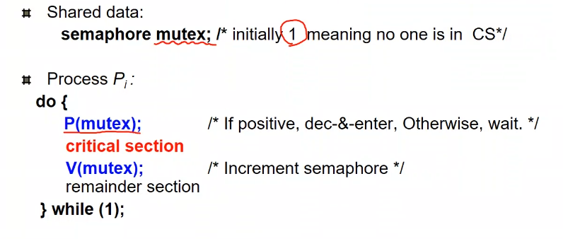

# process synchronization

여로 프로세스나 스레드가 동시에 데이터에 접근시 문제가 됨.

동시에 접근해서 바꿀려고 하는 현상 - race condition

누가 마지막으로 쓴가에 따라 값이 변할수 있음. 동기화가 필요하다.

수학적으로 2가 맞지만 1이 저장됨.

## Critical Section Problem

N개의 프로세스가 동시에 같은 데이터에 접근하는 코드를 Critical Section이라고 부른다. 어떤 프로세스가 critical section을 실행시 다른 프로세스가 못 사용하게 하는 것이 중요하다.

### Requirement

- Mutual Exclusion
  - 상호 배타적으로 움직이지 못하게 함
- Progress
  - 현재 critical을 수행하는 작업이 없는데 다른 작업이 들어갈수 없으면 안된다.
- Bounded Waiting
  - 다른 작업이 사용중인 경우 계속 기다려야 되는 경우를 막아야 한다.
  - 혼자 못들어가는 경우가 발생해선 안된다. (starvation)

#### Inital Attempts

entry에서는 자신이 쓴다는 걸 알려주고 exit에서는 다른 프로세스에게 알려줘야함. 프로세스간 공유되는것이 이 중간에 생김.

turn으로 관리는 되지만. P0와 P1이 turn으로 관리하는 경우 자신의 turn에서만 들어가게 됨.

progress는 보장안함. p0가 사용하고 턴이 1 이 되었지만 p1이 거기에 한번도 접속안하는 경우 턴은 1에서 안바뀐다. 이 경우 p0는 계속 기다려야만 한다. swap-turn.

#### Algorithm 2

턴 말고 flag를 사용. 들어간 경우 true가 아니면 false가 된다.

다른 프로세스가 들어갈 의지가 있으면 일단 기다리고, 상대가 나오면 flag가 false인 경우 실행 하러 간다. swap-turn은 발생 안함.

그러나 progress가 안됨.

둘다 동시에 둘어갈 마음이 있는경우 서로 양보해서 progress가 실행이 안됨.ㄴ

#### Algorithm 3 (Peterson's Algorithm)

동시에 들어갈 경우 교통정리 하는 것. flag과 turn을 둘다 사용

순서가 상대고 들어갈 의지가 있는 경우 기다림.

순서가 상대여도 들어갈 의지가 있으면 무조건 들어감.

순서가 자신이면 무조건 들어가게 됨.

문제점: Busy waiting(기다리면서 cpu 사용함)

while문을 돌면서 기다림. 별로 안좋음

#### Better solution: Lock

기존의 방법은 동기화 알고리즘을 다 알고 코딩을 해야함. 그냥 기본적으로 하나만으로 해결하는 방식이 중요함.

lock으로 확보한 경우만 들어감.

lock은 반드시 한명에게만 주어 져야 한다.

#### Synchronization Hardware

서로 다른 프로세스가 lock을 require해야 하는 이유는 코어가 여러개이기 때문이다. Scheduling으로 인하여 읽고 쓰기가 한번에 작업 되는 것이 아닌 순차적으로 프로세스를 바꿈으로 interrieved execution이 발생 하는 것이다. 중요한 critical part를 실행시 scheduling을 하지 않게 하는 것이 중요하다.

물리적으로 코드가 하나만 있으면 동시에 scheduling 안하도록 하면 된다.

CPU가 스케줄링 발생하는 경우는 tq가 끝난 경우 IO 발생 하는 경우.

두번째 케이스는 존재 하지 않음. Tq는 timer interrupt이다. CPU가 여러개인 경우 general solution 안됨.

해결하기 위한 hardware 회로 제공. 회로는 single cycle에 무조건 끝낸다. Atomic hardware. TAS & Swap

Target의 값을 트루로 바꿔주고 원래의 값을 돌려준다

이러면 트루로 들어간 경우 어차피 트루로 반환되고, false가 들어가야 만 false로 반환되어 아래 critical code를 실행할수 있다. 수행후 lock을 false로 다시 변환.

다른 작업이 이 코드를 실행하는 경우 true가 반환 됨으로 while문에서 벗어 못난다.

문제점: busy waiting....

두번째 하드웨어로 Swap 두 값을 바꿈.

key가 true인 동안 lock과 값을 바꿔라. lock false가 되면 key가 false 로 바뀌고 lock은 true로 바뀌에 된다. 먼저 들어간 프로세스가 나오기 전짜기 계속 lock은 True임으로 critical section을 실행 못하게 된다.

### Semaphore

하드웨어를 사용하지 않고 오로지 코드만으로 가능케 하는 법.

변수 하나를 선언 하고,
이를 접근하는 operation 2개로 한정되어 있다.

P(S) 는 queue이다. wait function. S값이 0보다 작으면 while에서 기다리고, 커지면 S-- 하고 빠져나온다.

V(S) 는 이제 끝냈을 경우 사용하게 된다. signal function S를 ++하고 빠져나온다

Mutex는 1으로 시작.

P(Mutex)를 실행하면 바로 시작, 이상 P() 를 부르면 대기하게 된다. V()를 부르게 되면 1이 되면서 기존의 기다리던 녀석이 들어가게 된다.

가능 한 이유: P,V가 atomic한 함수이기 때문에 가능한것이다. How?

atomic 하지 않은 경우. 동시에 Mutex값을 읽을수 있게된다. 1인 경우 모든 프로세스가 동시에 접속하면 다 내려오게 된다. 대 참 사 !!!!

P,V가 atomic하다면 critical section problem은 해결이 가능하다.

어떻게 atomic하게 만드는가?

P, V 에 interrupt disable을 시킨다. single인 경우는 이걸로 충분.

Peterson Algorithm으로 S값을 보호한다. 한번만 선언해주면 계속 사용 가능해짐 매우 쉬어짐.

Busy waiting을 해결해야 한다.

#### Block, WakeUp(p)

while 로 기다리는 것이 아닌, sleep을 시켜 버린다.

작업들을 p에 넣는 경우 저 linkedlist로 포인터에 배당하고 block 시킨다.

V에서 값을 하나 증가 시키고 양수가 아닌 경우 기다리는 프로세스가 있는 것. wakeup 실행

하드웨어가 제공하는 경우 쓰는데 더 좋을수 있음.
