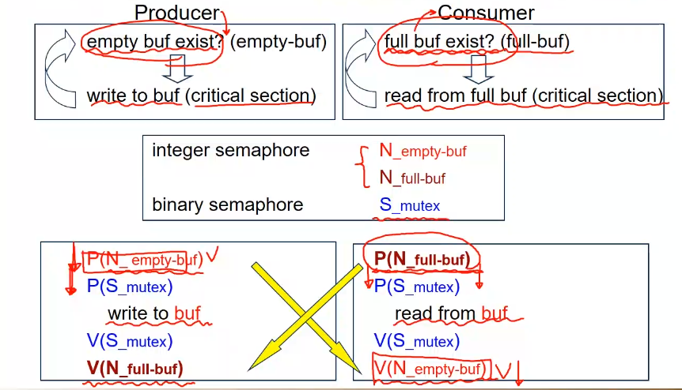

# 동기화 문제 해결 방법

## Bounded Buffer Problem

Producer Consumer Problem이라도고 불린다. 데이터를 만드는 자와 사용하는 자가 다르다.

Produce가 버퍼에 쓰고 reader가 읽는다. Buffer는 크기가 유한하고, 이것은 공유된다.

접근이 동기화가 되어야 한다. P, V로 해결가능하다.

문제는 다른 곳에 있다.

버퍼가 꽉 찬경우, 버퍼가 없는 경우 문제가 생긴다.

버퍼에 접근할수 있는 경우만 사용한다.

총 3가지 semaphore를 사용해야 한다.

제공하는 자와 읽는 자가 다름으로 코드상 사용하는 구간이 다를 수 있는 것이다.

P(empty)를 제작자가 호출, 뮤텍스를가져와 읽게만 함. Full buffer가 있다는 신호를 컨슈머에 보내면 이제 사용하고 empty를 하나 줄여준다.

아 empty함수는 시작하면 무조건 끝이 나는 semaphore임으로 자연스럽게.

## Reader-Writers Problem

리더는 데이터를 소비하지 않음. 리더는 단지 읽고 끝임으로 읽는 것 자체는 concurrent하게 해도 가능하다.

A. 리더가 먼저 읽게 함.
B. 리더가 있더라도 writer가 먼저 작업하게 함.

첫번째 솔루션을 먼저 함.
Mutex, db, readcount를 semaphore로 선언

처음 실행되는 Reader가 p(db) 선언 마지막 애가 v(db) 사용하여 하는 도중 라이터가 사용 못하게 함.

리드 카운트를 증가하고 감소하는 과정은 atomic해야 한다. Mutex를 활용하여 보호 해준다.

## Philosophers Problem

젓가락을 동시에 잡을수 없도록 semaphore로 동기화를 이루어 준다. 왼쪽 젓가락을 먼저 들고 오른쪽을 들게 하는 알고리즘을 처음 제안한다. 그러나 이 경우 deadlock이 발생함.

해결법

1. 동시에 들기
2. 홀수는 왼쪽 젓가락, 짝수는 오른쪽 먼저 들게 한다.
3. 총 5자리중 4명만 앉힌다.

## Semaphore의 문제점

1. 코딩 어려움
2. 증명하기 어려움, 문제가 잘 발생 안함
3. 협력이 어려움
4. 하나의 실수로 전체 시스템에 문제가 생긴다.

도구는 좋지만, 정작 사용이 너무 힘들다.

## Moniters

추상적 데이터 형을 sharing을 하게 해준다.

Class와 비슷하게 생김.

Moniter라는 데이터 타입을 통해 안전한 접근을 가능케 하낟.

모니터가 제공하는 핵심 기능. 모니터에서 작업하는 프로세스는 하나의 process만 active하게 해준다.

method를 호출가능한 프로세스는 하나만 있다는 것이다.

Entry Queue를 제공한다.

문제점:
Method안에서 실행하는 도중 문제가 발생하여 더이상 사용 못하는 경우가 발생. 이때 해결책이 본인이 아닌 외부요인.

기다리는 동안 busy wait를 하면 안됨. Consumer가 기다리고 있으면서 producer가 들어오는 것을 불가능 한 상황이 발생할수 있다.

해결하기 위해 Sleep()을 해버리게 한다. 이러면 다른 process가 들어와서 기존 sleep()한 작업이 실행 가능하게 해준다.

condition variable을 선언한다. 변수에서 잠드는 것과 깨나는 것을 가능하게 한다.

모니터를 사용한 philosopher 해결방법.

동시에 잡게 하는 방식으로 해결한다.

PickUp을 사용시 test를 자신에게 실행 test는 들었다면 state가 바뀜. 안 바뀐 경우 자신을 수면으로 보내고, 기다린다. 다른 작업이 끝날때 putdown을 call하면 state를 바꾸고 자신의 왼쪽과 오른쪽이 들수 있는지 확인하기 위해 test를 양쪽에 실행한다. 만약 밥을 먹고 있다면, 아무것도 실행하지 않고, 모든 상황이 맞다면 그 작업이 test에서 깨어나게 된다.

외부에서 사용되는 pickup과 putdown이 test를 사용하여 구현됨.

x.wait(c)를 사용하여 일반화를 진행하여 priority를 제공 할수 있다. 여러 프로세스가 함께 기다리는 경우에 사용 가능하다.

아니면 아까와 같이 하나만 콕 찝어서 사용도 가능하다.

- 두가지 조건을 만족해야함

1. Function을 호출하는 순서를 지켜야 한다.
2. Monitor 내에서 선언된 shared 변수를 접근하는 것을 막아야 한다. 문법 적으로는 문제 없을수 있다.
